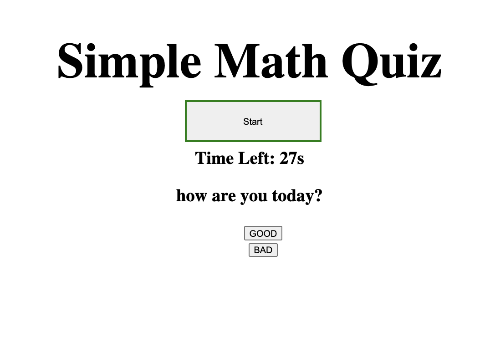

# lets_take_a_quiz
game which includes questions

This was a simple generic game that has 3 questions with a timer in it

PLEASE NOTE: I have not managed to successfully showcase my scores at the end of the quiz but I am hoping to get some help and try to ammend my code

## Tabel of Contents

* [LINKS](#Links)
* [SCREENSHOT](#SCREENSHOT)
* [INSTALL](#Installation)
* [USAGE](#Usage)
* [CONTRIBUTE](#Contribute)
* [CONTACT](#Questions)

# Links

Github Repo : https://github.com/kishan254/lets_take_a_quiz

Live Github URL: https://kishan254.github.io/lets_take_a_quiz/

# SCREENSHOT
 

 

## Installation

In order to run this application, you will need to install the following

- npm instal node.js
- npm install inquirer
- npm i

## Usage

In order to use this app, you will need to understand the following;

- Node

## Contribute

- Node

## Questions

Please click the links below

[Github] (https://github.com/kishan254)

Write me on;

[Email] (kishan.gosrani@hotmail.com)

