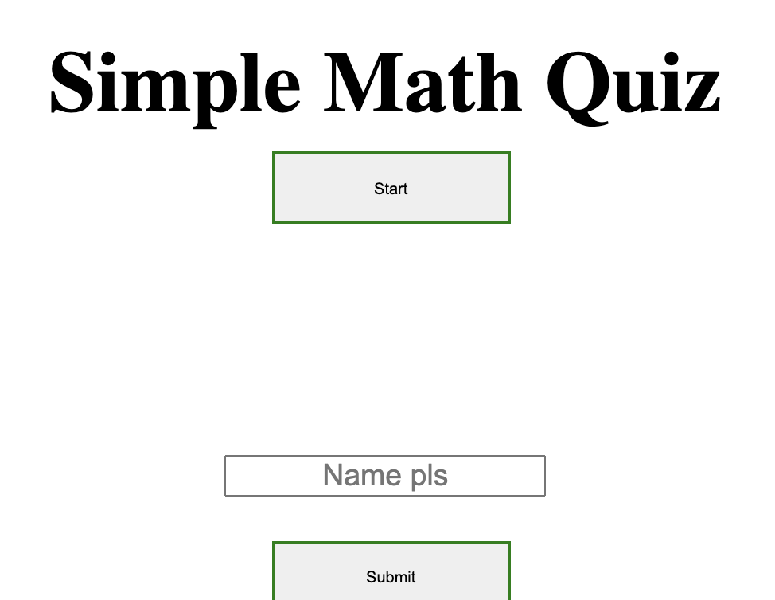
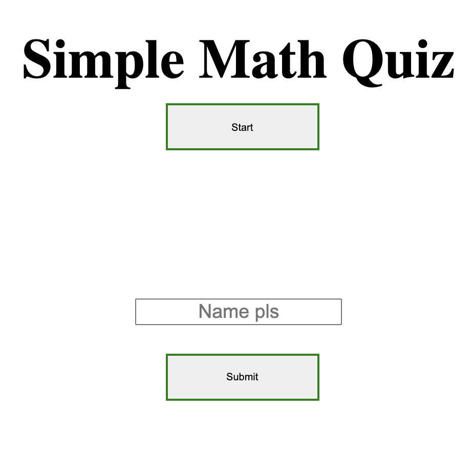

# lets_take_a_quiz
game which includes questions

This was a simple generic game that has 3 questions with a timer in it

I have not managed to successfully showcase my scores at the end but I am hoping to get some help and try to ammend my code

# Links to the project

Github Repo : https://github.com/kishan254/lets_take_a_quiz

Live Github URL: https://kishan254.github.io/lets_take_a_quiz/

# SCREENSHOT OF QUIZ
 

 

 

 
